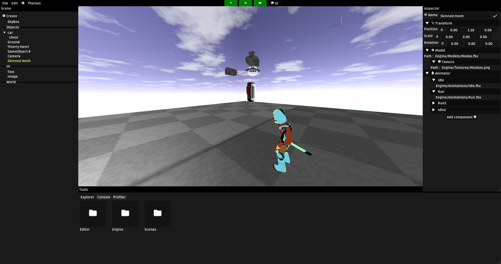

# GigenEngine

## Quick presentation
3 Months-long school assignment by groups of 3. The objective is to make an usable engine and make a demo game out of that Engine. 

## Installation

- Run CMake at the root

## Features

- Scene Graph with Quaternions
- In-Game UI (ScreenSpace & WorldSpace)
- Skeletal Animation
- Scripting in lua
- Serialization
- Physics
- Editor
- Shadow mapping (unfinished)

## Authors
- <a href="https://github.com/Angel-2180" target="_blank">@Angel</a>
- <a href="https://github.com/Kouros26" target="_blank">@Kouros</a>
- <a href="https://github.com/AymericIsart" target="_blank">@Aymeric</a>